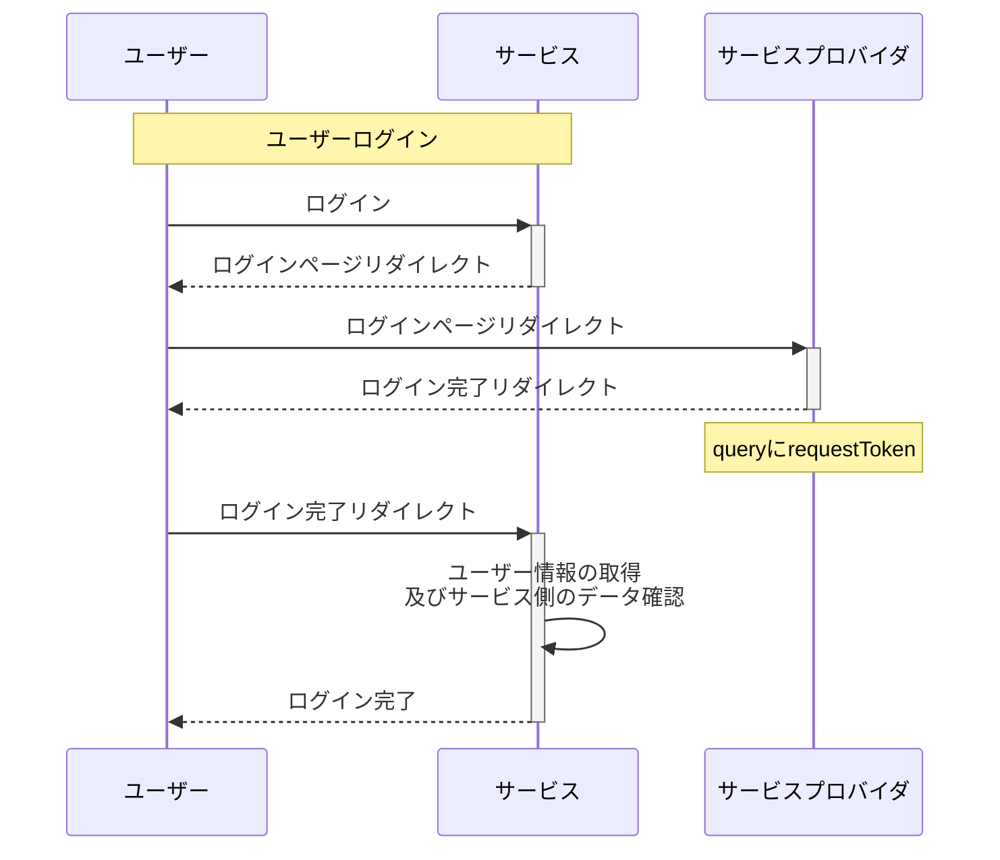

# OAuth2認証について勉強

## 目的
- ユーザーの認証をOAuthを用いてできるようにしたい

## やったこと
- OAuthについて、フローの理解し直し
- google oauthを用いて認証部分の実装

## OAuthについて
- サービスプロバイダのユーザー情報を利用して認証を行う仕組み
- サービス側からサービスプロバイダへのリクエストに必要なトークンをログイン時に取得して、リクエスト可能な状態にする

## 参考URL
- [Oauth for goole](https://developers.google.com/identity/protocols/oauth2)
- [OpenIdConnect](https://developers.google.com/identity/protocols/oauth2/openid-connect)
- [一番分かりやすい OAuth の説明](https://qiita.com/TakahikoKawasaki/items/e37caf50776e00e733be)