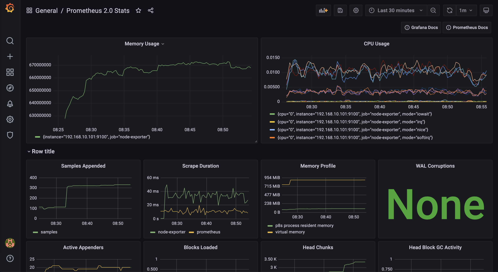
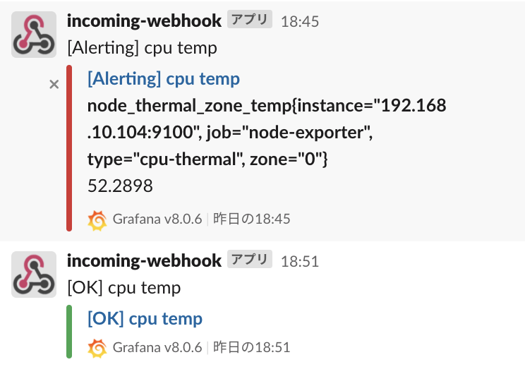

# prometheusとgrafanaによる監視とモニタリング

## 概要
- prometheusとgrafanaに触れてみる回

## 実施理由
- 家にあるRaspberryPiで何かしらする際に、状態の監視ができる状態にしようと考えて、prometheusで監視できる状態にしようと考えたため
- grafanaでメトリクスが見やすい状態にして監視状況を見れると良いと考えた

## 動作手順
docker-composeにて、起動後に `localhost:3000` にて、grafanaに接続して、prometheusを利用するように設定する。
```shell
docker-compose up -d
```

grafana画面上で、DataSourceにてPrometheusの設定追加
PrometheusのDashBoardにて、 `Prometheus 2.0 Stats` を指定して追加

## grafanaのalert設定
1. slackのwebhookUrlを取得
2. grafanaページにて、DashBoardを表示
3. DashBoardにalertを設定できるので、しきい値や通知方法を設定

## 検証方法
下記コマンドにて、CPUの利用をあげてalertが飛ぶか確認して問題なかった

```
openssl speed -multi `grep processor /proc/cpuinfo|wc -l`
```

## 進捗
- 20210718: 現状はlocalでの起動確認とmemoryの使用率等の取得が可能な状態
  
- slackにalertを出す設定 
- 

## 参考リンク
- https://grafana.com/grafana/dashboards/3662
- https://knowledge.sakura.ad.jp/27501/
- https://grafana.com/oss/grafana/
